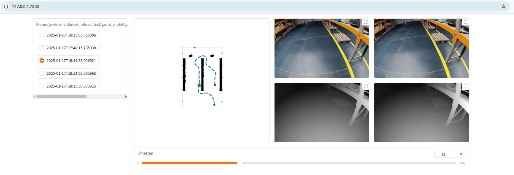
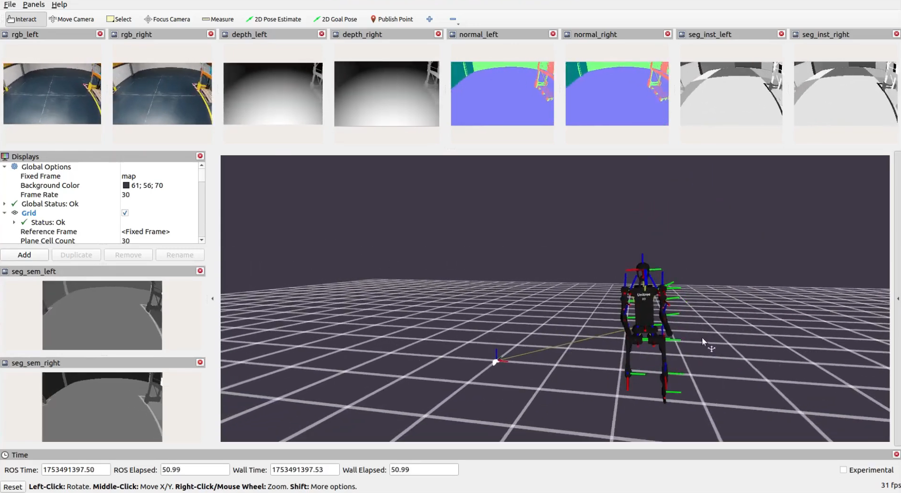

<h1 align="center"><span> Isaac Sim Mobility Generator</span></h1>


<p align="center">
  <a href="https://www.youtube.com/watch?v=sXSWYkoECMg" target="_blank">
    
  </a>
</p>

## License

The code is distributed under the CC BY-NC-SA 4.0 License.
See [LICENSE](LICENSE) for more information.

```python
# Copyright (C) 2025-present by ShalikAI. All rights reserved.
# Licensed under CC BY-NC-SA 4.0 (non-commercial use only).
```

## Overview

MobilityGen is a toolset built on [NVIDIA Isaac Sim](https://developer.nvidia.com/isaac/sim) that enables you to easily generate and collect data for mobile robots.

It supports

- ***Rich ground truth data***

    - Occupancy Map
    - Pose
    - Joint Positions / Velocities
    - RGB Images
    - Segmentation Images
    - Depth Images
    - Instance Segmentation Images
    - Normals Images

- ***Many robot types***

    - Differential drive - Jetbot, Carter
    - Quadruped - Spot
    - Humanoid - H1
    - *Implement your own by subclassing the [Robot](./exts/omni.ext.mobility_gen/omni/ext/mobility_gen/robots.py) class*

- ***Many data collection methods***

    - Manual - Keyboard Teleoperation, Gamepad Teleoperation
    - Automated - Random Accelerations, Random Path Following
    - *Implement your own by subclassing the [Scenario](./exts/omni.ext.mobility_gen/omni/ext/mobility_gen/scenarios.py) class*

This enables you to train models and test algorithms related to robot mobility.

To get started with MobilityGen follow the setup and usage instructions below!

## Table of Contents

- [Requirements](#requirements)
- [Setup](#setup)
- [Basic Usage](#usage)
- [How To Guides](#howto)
    - [How to record procedural data](#how-to-procedural-data)
    - [How to implement a custom robot](#how-to-custom-robot)
    - [How to implement a custom scenario](#how-to-custom-scenario)
- [Data Format](#data-format)
- [Inspect Data](#inspect-data)
- [Convert to ROS Format](#ros2)
    - [Demo Data](#demo-data)
- [Convert to LeRobot Format](#lerobot)
- [Debugging](#debugging)

<a id="requirements"></a>
## Requirements

This work has been tested on Ubuntu 22.04, IsaacSim-4.5, ROS2 Humble, Nvidia RTX 3060 with 6GB VRAM, Cuda 12.4 and Python 3.10.

<a id="setup"></a>
## Setup

Follow these steps to set up Isaac Sim Mobility Generator.

### Step 1 - Install Isaac Sim

1. Download [Isaac Sim 4.5.0](https://docs.isaacsim.omniverse.nvidia.com/latest/installation/download.html). Isaac Sim should be installed in ``~/isaacsim``.

### Step 2 - Clone this repository

1. Clone the repository

    ```bash
    https://github.com/ShalikAI/Isaac-Sim-Mobility-Generator.git
    ```

### Step 3 - Link Isaac Sim

Next, we'll call ``link_app.sh`` to link the Isaac Sim installation directory to the local ``app`` folder.

1. Navigate to the repo root

    ```bash
    cd Isaac-Sim-Mobility-Generator
    ```

2. Run the following to link the ``app`` folder and pass it the path to where you installed Isaac Sim

    ```bash
    ./link_app.sh --path ~/isaacsim
    ```

<details>
> This step is helpful as it (1) Enables us to use VS code autocompletion (2) Allows us to call ./app/python.sh to launch Isaac Sim Python scripts (3) Allows us to call ./app/isaac-sim.sh to launch Isaac Sim.
</details>

### Step 4 - Install other python dependencies (including C++ path planner) (for procedural generation)

1. Install miscellaneous python dependencies

    ```bash
    ./app/python.sh -m pip install tqdm
    ```

2. Navigate to the path planner directory

    ```bash
    cd ~/Isaac-Sim-Mobility-Generator/path_planner
    ```

3. Install with pip using the Isaac Sim python interpreter

    ```bash
    ../app/python.sh -m pip install -e .
    ```

    > Note: If you run into an error related to pybind11 while running this command, you may try ``../app/python.sh -m pip install wheel`` and/or ``../app/python.sh -m pip install pybind11[global]``.

### Step 4 - Launch Isaac Sim

1. Navigate to the repo root

    ```bash
    cd ~/Isaac-Sim-Mobility-Generator
    ```

2. Launch Isaac Sim with required extensions enabled by calling

    ```bash
    ./scripts/launch_sim.sh
    ```

If everything worked, you should see Isaac Sim open with a window titled ``MobilityGen`` appear. Read [Usage](#usage) below to learn how to generate data with MobilityGen.

<a id="usage"></a>
## Basic Usage

Below details a typical workflow for collecting data with Isaac-Sim-Mobility-Generator.

### Step 1 - Launch Isaac Sim

1. Navigate to the repo root

    ```bash
    cd Isaac-Sim-Mobility-Generator
    ```

2. Launch Isaac Sim with required extensions enabled by calling

    ```bash
    ./scripts/launch_sim.sh
    ```

### Step 2 - Build a scenario

This assumes you see the MobilityGen extension window.

1. Under Scene USD URL / Path copy and paste the following

    ```
    http://omniverse-content-production.s3-us-west-2.amazonaws.com/Assets/Isaac/4.2/Isaac/Environments/Simple_Warehouse/warehouse_multiple_shelves.usd
    ```

2. Under the ``Scenario`` dropdown select ``KeyboardTeleoperationScenario`` to start

3. Under the ``Robot`` dropdown select ``H1Robot``

4. Click ``Build``

After a few seconds, you should see the scene and occupancy map appear.

### Step 3 - Initialize / reset the scenario

1. Click the ``Reset`` function to randomly initialize the scenario.  Do this until the robot spawns inside the warehouse.


### Step 4 - Test drive the robot

Before you start recording, try moving the robot around to get a feel for it

To move the robot, use the following keys

- ``W`` - Move Forward
- ``A`` - Turn Left
- ``S`` - Move Backwards
- ``D`` - Turn right

### Step 5 - Start recording!

Once you're comfortable, you can record a log.

1. Click ``Start Recording`` to start recording a log.

    > You should now see a recording name and the recording duration change.
2. Move the robot around
3. Click ``Stop Recording`` to stop recording.

The data is recorded to ``~/MobilityGenData/recordings`` by default.

<p align="center">
  <a href="https://www.youtube.com/watch?v=jR9Ikk9bB9w" target="_blank">
    
  </a>
</p>

### Step 6 - Render data

If you've gotten this far, you've recorded a trajectory, but it doesn't include the rendered sensor data.

Rendering the sensor data is done offline.  To do this call the following

1. Close Isaac Sim if it's running

2. Navigate to the repo root

    ```bash
    cd Isaac-Sim-Mobility-Generator
    ```

3. Run the ``scripts/replay_directory.py`` script to replay and render all recordings in the directory

    ```bash
    python3 scripts/replay_directory.py --render_interval=200
    ```

    > Note: For speed for this tutorial, we use a render interval of 200.  If our physics timestep is 200 FPS, this means we
    > render 1 image per second.

If you have `num_steps = 10,000` simulation steps and `--render_interval=200`, then it only replays and renders every 200th frame, i.e., at frames:0, 200, 400, ..., 9800.

If you change it to `--render_interval=2000`,
you’ll be rendering even fewer frames only at: 0, 2000, 4000, 6000, 8000 (i.e., 5 frames from 10,000).


High value (e.g., 2000): For quick preview or sparse sampling, less rendering time.

Low value (e.g., 1, 10, 100): For dense re-rendering, e.g., when high-fidelity output is needed for training or analysis.

The data with renderings should be stored in ``~/MobilityGenData/replays``.

### Step 7 - Visualize the Data

A few examples in the [examples](./examples) folder are provided for working with the data. The data and directory organization is the following:

```
2025-07-24T18:34:55.006521/
    occupancy_map/
        map.png
        map.yaml
    config.json
    stage.usd
    state/
        common/
            00000000.npy
            00000001.npy
            ...
        depth/
            robot.front_camera.left.depth_image/
                00000000.png
                00000001.png
                ...
            robot.front_camera.right.depth_image/
                ...
        rgb/
            robot.front_camera.left.rgb_image/
                00000000.jpg
                00000001.jpg
            robot.front_camera.right.rgb_image/
                ...
        segmentation/
            robot.front_camera.left.segmentation_image/
                00000000.png
                00000001.png
                ...
            robot.front_camera.right.segmentation_image/
                ...
        normals/
            robot.front_camera.left.normals_image\
                00000000.npy
                00000001.npy
                ...

```

Most of the state information is captured under the ``state/common`` folder, as dictionary in a single ``.npy`` file.

However, for some data (images) this is inefficient.  These instead get captured in their own folder based on the data
type and the name.  (ie: rgb/robot.front_camera.left.depth_image).

The name of each file corresponds to its physics timestep.

One example is using Gradio to explore all of the recordings in the replays directory.  To run this example,
call the following:

1. Install Gradio in your system:
    ```bash
    python3 -m pip install gradio
    ```
2. Call the gradio data visualization example script

    ```bash
    python3 examples/04_visualize_gradio.py
    ```

2. Open your web browser to ``http://127.0.0.1:7860`` to explore the data

If everything worked, you should be able to view the data in the browser.



### Next steps

That's it!  Once you've gotten the hang of how to record data, you might try

1. Record data using one of the procedural methods (like ``RandomAccelerationScenario`` or ``RandomPathFollowingScenario``).

    > These methods don't rely on human input, and automatically "restart" when finished to create new recordings.

2. Implement or customize your own [Robot](./exts/omni.ext.mobility_gen/omni/ext/mobility_gen/robots.py) class.
3. Implement or customize your own [Scenario](./exts/omni.ext.mobility_gen/omni/ext/mobility_gen/scenarios.py) class.


<a id="howto"></a>
## How To Guides

<a id="how-to-procedural-data"></a>
### How to record procedural data

#### Step 1 - Launch Isaac Sim

This is the same as in the basic usage.

1. Navigate to the repo root

    ```bash
    cd Isaac-Sim-Mobility-Generator
    ```

2. Launch Isaac Sim with required extensions enabled by calling

    ```bash
    ./scripts/launch_sim.sh
    ```

#### Step 2 - Build a scenario

1. Under Scene USD URL / Path copy and paste the following

    ```
    http://omniverse-content-production.s3-us-west-2.amazonaws.com/Assets/Isaac/4.2/Isaac/Environments/Simple_Warehouse/warehouse_multiple_shelves.usd
    ```

2. Under the ``Scenario`` dropdown select ``RandomPathFollowingScenario`` or ``RandomAccelerationScenario``

3. Under the ``Robot`` dropdown select ``H1Robot``

4. Click ``Build``

After a few seconds, you should see the scene and occupancy map appear.

#### Step 3 - Record data

1. Click ``Start Recording`` to start recording data

2. Go grab some coffee!

    > The procedural generated methods automatically determine when to reset (ie: if the robot collides with
    > an object and needs to respawn).  

3. Click ``Stop Recording`` to stop recording data.

The data is recorded to ``~/MobilityGenData/recordings`` by default.

#### Step 4 - Render and visualize sensor data

This is the same as before.  Please refer to Step 6-7 of the "Basic Usage" guide.

<a id="how-to-custom-robot"></a>
### How to implement a new robot

You can implement a new robot for use with MobilityGen.

The general workflow is as follows:

1. Subclass the [Robot](exts/omni.ext.mobility_gen/omni/ext/mobility_gen/robots.py) class.
2. Implement the ``build()`` method.  This method is responsible for adding the robot to the USD stage.
2. Implement the ``write_action()`` method.  This method performs the logic of applying the linear, angular velocity command.
3. Overwrite the common class parameters (like ``physics_dt``, ``occupancy_map_z_min``, etc.)
4. Register the robot class by using the ``ROBOT.register()`` decorator.  This makes the custom robot discoverable.

We recommend referencing the example robots in [robots.py](exts/omni.ext.mobility_gen/omni/ext/mobility_gen/robots.py) for more details.

A good way to start could be simply by modifying an existing robot.  For example, you might change the position at which
the camera is mounted on the H1 robot.

<a id="how-to-custom-scenario"></a>
### How to implement a new scenario

You can implement a new data recording scenario for use with MobilityGen.

The general workflow is as follows:

1. Subclass the [Scenario](exts/omni.ext.mobility_gen/omni/ext/mobility_gen/scenarios.py) class.
2. Implement the ``reset()`` method.  This method is responsible for randomizing / initializing the scenario (ie: spawning the robot).
3. Implement the ``step()`` method.  This method is responsible for incrementing the scenario by one physics step.
4. Register the scenario class by using the ``SCENARIOS.register()`` decorator.  This makes the custom scenario discoverable.

We recommend referencing the example scenarios in [scenarios.py](exts/omni.ext.mobility_gen/omni/ext/mobility_gen/scenarios.py) for more details.

A good way to start could be simply by modifying an existing scenario.  For example, you might implement a new method
for generating random motions.

<a id="data-format"></a>
## Data Format

MobilityGen records two types of data.

- *Static Data* is recorded at the beginning of a recording
    - Occupancy map
    - Configuration info
        - Robot type
        - Scenario type
        - Scene USD URL
    - USD Stage
- *State Data* is recorded at each physics timestep
    - Robot action: Linear, angular velocity
    - Robot pose: Position, quaternion
    - Robot joint Positions / Velocities
    - Robot sensor data:
        - Depth image
        - RGB Image
        - Segmentation image / info
        - Instance Segmentation
        - Normals


<a id="inspect-data"></a>
## Inspect Data
If you want to pelvis pose:
```
python3 examples/inspect_poses.py ~/MobilityGenData/replays/2025-07-19T10:08:32.202022/state/common 1
```
Here is the output:
```
Frame 00:
  raw pos = [5.4326077  1.480456   0.89978415]
  raw quat = [-0.60124445 -0.0496252   0.00937337  0.7974676 ]
  → roll=-74.2°, pitch=-3.9°, yaw=4.3°
```
If you want to inspect the left camera pose:
```
python3 examples/inspect_left_camera_poses.py ~/MobilityGenData/replays/2025-07-19T10:08:32.202022/state/common 1
```
Here is the output:
```
[0] Pelvis
  Position: (x=5.433, y=1.480, z=0.900)
  Quaternion: qw=-0.601, qx=-0.050, qy=0.009, qz=0.797
  Euler:     roll=4.3°, pitch=3.9°, yaw=-105.8°

[0] Front‑Left Camera
  Position: (x=5.413, y=1.323, z=1.588)
  Quaternion: qw=0.145, qx=0.035, qy=0.463, qz=0.874
  Euler:     roll=55.3°, pitch=4.2°, yaw=163.3°
```
If you want to inspect the segmentation images:
```
python3 examples/inspect_segmentation.py ~/MobilityGenData/replays/2025-07-19T10:08:32.202022/state/segmentation --num 1
```
Here is the output:
```
Folder: robot.front_camera.left.instance_id_segmentation_image
  Total files: 68
  File: 00000000.png
    dtype: int32, shape: (600, 960)
    unique labels: 100
    top-5 labels (label:count): [(1860, 154310), (1199, 151885), (1295, 75824), (1271, 35472), (499, 17373)]

Folder: robot.front_camera.left.segmentation_image
  Total files: 68
  File: 00000000.png
    dtype: int32, shape: (600, 960)
    unique labels: 11
    top-5 labels (label:count): [(4, 457476), (5, 73639), (2, 18635), (3, 9636), (8, 7260)]

```
If you want to inspect the normal images:
```
python3 examples/inspect_normals.py ~/MobilityGenData/replays/2025-07-19T10:08:32.202022/state/normals --num 1
```
Here is the output:
```
Camera folder: robot.front_camera.left.normals_image
  File: 00000000.npy
    dtype: float32
    shape: (600, 960, 4)
    min/max: -1.0000 / 1.0000
    mean/std: 0.4690 / 0.5292

Camera folder: robot.front_camera.right.normals_image
  File: 00000000.npy
    dtype: float32
    shape: (600, 960, 4)
    min/max: -1.0000 / 1.0000
    mean/std: 0.4705 / 0.5279
```
If you want to inspect the common files:
```
python3 examples/inspect_common_file.py ~/MobilityGenData/replays/2025-07-19T10:08:32.202022/state/common --num 1
```
The output was the following:
```
Found 68 .npy files. Inspecting first 1:

File: /home/arghya/MobilityGenData/replays/2025-07-19T10:08:32.202022/state/common/00000000.npy
  Type: <class 'numpy.ndarray'>
  Structure (keys and types/shapes):
    - robot.action: array, dtype=float64, shape=(2,)
    - robot.position: array, dtype=float32, shape=(3,)
    - robot.orientation: array, dtype=float32, shape=(4,)
    - robot.joint_positions: array, dtype=float32, shape=(19,)
    - robot.joint_velocities: array, dtype=float32, shape=(19,)
    - robot.front_camera.left.segmentation_info: <class 'dict'>, value={'idToLabels': {'0': {'class': 'BACKGROUND'}, '1': {'class': 'UNLABELLED'}, '2': {'class': 'rack'}, 
    - robot.front_camera.left.instance_id_segmentation_info: <class 'dict'>, value={'idToLabels': {'1': 'INVALID', '8': 'INVALID',...
    - robot.front_camera.left.position: array, dtype=float32, shape=(3,)
    - robot.front_camera.left.orientation: array, dtype=float32, shape=(4,)
    - robot.front_camera.right.segmentation_info: <class 'dict'>, value={'idToLabels': {'0': {'class': 'BACKGROUND'}, '1': {'class': 'UNLABELLED'},....
    - robot.front_camera.right.instance_id_segmentation_info: <class 'dict'>, value={'idToLabels': {'1': 'INVALID', '8': 'INVALID',...
    - robot.front_camera.right.position: array, dtype=float32, shape=(3,)
    - robot.front_camera.right.orientation: array, dtype=float32, shape=(4,)
    - keyboard.buttons: array, dtype=bool, shape=(4,)
```
If you want to inspect the joints and their states:
```
python3 examples/inspect_joints.py ~/MobilityGenData/replays/2025-07-19T10:08:32.202022/state/common --frame 0
```
Here is the output:
```
Frame 00:
  Joint positions (shape (19,)):
    [ 0.0285178  -0.06889407 -0.00940297 -0.03465765 -0.02505827  0.3011327
  0.27076805 -0.6683024  -0.59880084 -0.0539261  -0.02191565  1.4317086
  1.2333937   0.0024948  -0.00682147 -0.6336425  -0.7075511   0.5251975
  0.5055799 ]
  Joint velocities(shape (19,)):
    [ 2.9184083e-02  1.4257843e-02 -2.9104811e-03  7.8836689e-03
 -3.1841312e-02 -2.3049731e-03  3.5154899e-03  5.5881063e-03
  5.8478154e-03 -6.4434828e-03  2.9966049e-03 -2.0087871e-03
  7.8600556e-02  8.9578883e-04  1.2077199e-03 -1.3268487e-04
 -1.3865213e+00 -1.3560086e-05  7.1849755e-04]

Index → value (position, velocity):
  # 0:  pos=0.0285, vel=0.0292
  # 1:  pos=-0.0689, vel=0.0143
  # 2:  pos=-0.0094, vel=-0.0029
  # 3:  pos=-0.0347, vel=0.0079
  # 4:  pos=-0.0251, vel=-0.0318
  # 5:  pos=0.3011, vel=-0.0023
  # 6:  pos=0.2708, vel=0.0035
  # 7:  pos=-0.6683, vel=0.0056
  # 8:  pos=-0.5988, vel=0.0058
  # 9:  pos=-0.0539, vel=-0.0064
  #10:  pos=-0.0219, vel=0.0030
  #11:  pos=1.4317, vel=-0.0020
  #12:  pos=1.2334, vel=0.0786
  #13:  pos=0.0025, vel=0.0009
  #14:  pos=-0.0068, vel=0.0012
  #15:  pos=-0.6336, vel=-0.0001
  #16:  pos=-0.7076, vel=-1.3865
  #17:  pos=0.5252, vel=-0.0000
  #18:  pos=0.5056, vel=0.0007
```
If you want to inspect the robot actions (Linear and Angular Command Velocity):
```
python3 examples/inspect_actions.py ~/MobilityGenData/replays/2025-07-19T10:08:32.202022/state/common --frame 0
```
Here is the output:
```
Frame 20:
  robot.action (shape (2,), dtype=float64):
    #0: 1.000000
    #1: 0.000000
```

This data can easily be read using the [Reader](./examples/reader.py) class.

```python
from reader import Reader

reader = Reader(recording_path="replays/2025-01-17T16:44:33.006521")

print(len(reader)) # print number of timesteps

state_dict = reader.read_state_dict(0)  # read timestep 0
```

The state_dict has the following schema

```
{
    "robot.action": np.ndarray,                                      # [2] - Linear, angular command velocity
    "robot.position": np.ndarray,                                    # [3] - XYZ
    "robot.orientation": np.ndarray,                                 # [4] - Quaternion
    "robot.joint_positions": np.ndarray,                             # [J] - Joint positions
    "robot.joint_velocities": np.ndarray,                            # [J] - Joint velocities
    "robot.front_camera.left.rgb_image": np.ndarray,                 # [HxWx3], np.uint8 - RGB image
    "robot.front_camera.left.depth_image": np.ndarray,               # [HxW], np.fp32 - Depth in meters
    "robot.front_camera.left.segmentation_image": np.ndarray,        # [HxW], np.uint8 - Segmentation class index
    "robot.front_camera.left.segmentation_info": dict,               # see Isaac replicator segmentation info format
    "robot.front_camera.left.position": np.ndarray,                  # [3] - XYZ camera world position
    "robot.front_camera.left.orientation": np.ndarray,               # [4] - Quaternion camera world orientation
    ...
}
```

The ``Reader`` class abstracts away the details of reading the state dictionary
from the recording.

<a id="ros2"></a>
## Convert to ROS2 Format

You can publish the data once the rendering is finished. Convert the data as ROS2 topics:
```
python3 examples/mgen_to_mcap.py   --input ~/MobilityGenData/replays/2025-07-24T23:17:47.586765   --output ~/MobilityGenData/rosbags/2025-07-24.mcap   --hz 10.0
```
If you have exported 1 samples per second, use `--hz 1.0` instead.
Here are the topics the rosbag will have if you export at `10 hz` (Use `--render_interval=20` for 10 Hz export):
```
arghya@arghya-Pulse-GL66-12UEK:~/MobilityGenData/rosbags$ ros2 bag info 2025-07-24.mcap/

Files:             2025-07-24.mcap_0.mcap
Bag size:          9.7 GiB
Storage id:        mcap
Duration:          90.700000000s
Start:             Dec 31 1969 19:00:00.000000000 (0.000000000)
End:               Dec 31 1969 19:01:30.700000000 (90.700000000)
Messages:          19069
Topic information: Topic: /normals/image/robot_front_camera_left_normals_image | Type: sensor_msgs/msg/Image | Count: 908 | Serialization Format: cdr
                   Topic: /depth/image_raw/robot_front_camera_right_depth_image | Type: sensor_msgs/msg/Image | Count: 908 | Serialization Format: cdr
                   Topic: /depth/image_raw/robot_front_camera_left_depth_image | Type: sensor_msgs/msg/Image | Count: 908 | Serialization Format: cdr
                   Topic: /rgb/image_raw/robot_front_camera_left_rgb_image | Type: sensor_msgs/msg/Image | Count: 908 | Serialization Format: cdr
                   Topic: /segmentation/semantic/robot_front_camera_right_segmentation_image | Type: sensor_msgs/msg/Image | Count: 908 | Serialization Format: cdr
                   Topic: /segmentation/semantic/robot_front_camera_left_segmentation_image | Type: sensor_msgs/msg/Image | Count: 908 | Serialization Format: cdr
                   Topic: /segmentation/instance_id/robot_front_camera_right_instance_id_segmentation_image | Type: sensor_msgs/msg/Image | Count: 908 | Serialization Format: cdr
                   Topic: /pelvis_pose | Type: geometry_msgs/msg/PoseStamped | Count: 908 | Serialization Format: cdr
                   Topic: /tf | Type: tf2_msgs/msg/TFMessage | Count: 908 | Serialization Format: cdr
                   Topic: /cmd_vel | Type: geometry_msgs/msg/Twist | Count: 908 | Serialization Format: cdr
                   Topic: /rgb/camera_info/left | Type: sensor_msgs/msg/CameraInfo | Count: 908 | Serialization Format: cdr
                   Topic: /depth/camera_info/right | Type: sensor_msgs/msg/CameraInfo | Count: 908 | Serialization Format: cdr
                   Topic: /joint_states | Type: sensor_msgs/msg/JointState | Count: 908 | Serialization Format: cdr
                   Topic: /rgb/image_raw/robot_front_camera_right_rgb_image | Type: sensor_msgs/msg/Image | Count: 908 | Serialization Format: cdr
                   Topic: /rgb/camera_info/right | Type: sensor_msgs/msg/CameraInfo | Count: 908 | Serialization Format: cdr
                   Topic: /normals/image/robot_front_camera_right_normals_image | Type: sensor_msgs/msg/Image | Count: 908 | Serialization Format: cdr
                   Topic: /pelvis_odom | Type: nav_msgs/msg/Odometry | Count: 908 | Serialization Format: cdr
                   Topic: /left_camera_pose | Type: geometry_msgs/msg/PoseStamped | Count: 908 | Serialization Format: cdr
                   Topic: /tf_static | Type: tf2_msgs/msg/TFMessage | Count: 1 | Serialization Format: cdr
                   Topic: /depth/camera_info/left | Type: sensor_msgs/msg/CameraInfo | Count: 908 | Serialization Format: cdr
                   Topic: /right_camera_pose | Type: geometry_msgs/msg/PoseStamped | Count: 908 | Serialization Format: cdr
                   Topic: /segmentation/instance_id/robot_front_camera_left_instance_id_segmentation_image | Type: sensor_msgs/msg/Image | Count: 908 | Serialization Format: cdr
```
If you want to publish the robot state and visualize the robot model along with joint states in rviz, do the following
```
ros2 run robot_state_publisher robot_state_publisher   --ros-args -p robot_description:="$(cat ~/Isaac-Sim-Mobility-Generator/h1_description/urdf/h1.urdf)"
```
Now, open the rviz:
```
rviz2
```
Load the rviz file from this repo. You will see the output something like this below.

<p align="center">
  <a href="https://www.youtube.com/watch?v=sXSWYkoECMg" target="_blank">
    
  </a>
</p>

Make sure to create a override for latching static tf topics:
```
echo "/tf_static: {depth: 1, durability: transient_local}" > ~/.tf_overrides.yaml
```

Play the rosbag in the following way:
```
cd ~/MobilityGenData/rosbags
ros2 bag play 2025-07-24.mcap/2025-07-24.mcap_0.mcap --qos-profile-overrides-path ~/.tf_overrides.yaml
```

Joint States are published as `sensor_msgs/JointState.msg`. The  message can be broken down like this:
```
# This is a message that holds data to describe the state of a set of torque controlled joints. 
#
# The state of each joint (revolute or prismatic) is defined by:
#  * the position of the joint (rad or m),
#  * the velocity of the joint (rad/s or m/s) and 
#  * the effort that is applied in the joint (Nm or N).
#
# This message consists of a multiple arrays, one for each part of the joint state. 
# The goal is to make each of the fields optional. When e.g. your joints have no
# effort associated with them, you can leave the effort array empty. 
#
# All arrays in this message should have the same size, or be empty.


Header header

string[] name
float64[] position
float64[] velocity
float64[] effort
```

<a id="demo_data"></a>
### Demo Data
We have collected a demo data with the H1 robot from Unitree making it move inside a factory simulated environment in Isaac Sim. The data has been converted to ros2 bag following the tutorial. Here is the [link](https://drive.google.com/drive/folders/1R9ax5QuUj4DQv-KZhTbr9eEpLYpDRBwK?usp=sharing). 

<a id="lerobot"></a>
## Convert to the LeRobot Format

A script that converts a MobilityGen recording/replay to a [LeRobot](https://github.com/huggingface/lerobot) dataset can be found at [scripts/convert_to_lerobot.py](./scripts/convert_to_lerobot.py). The [LeRobot Python package](https://github.com/huggingface/lerobot?tab=readme-ov-file#installation) needs to be installed before executing the script.

Example usage for converting a single recording:
```
python ./scripts/convert_to_lerobot.py \
  --input "~/MobilityGenData/replays/2025-00-00T00:00:00.000000" \
  --output "/output/path" \
  --fps 30
```

Example usage for converting a collection of recordings:
```
python ./scripts/convert_to_lerobot.py \
  --input "/path/to/directory/containing/the/recordings" \
  --output "/output/path" \
  --batch \
  --fps 30
```

<a id="debugging"></a>
## Debugging
### Problem 1:
There are some issues with the joint states since the rendering is done in `USD` format and we are trying to convert to ros2 compatible `URDF` format. Here is the joint order:
```
#  0:  torso_joint
#  1:  right_shoulder_pitch_joint
#  2:  left_shoulder_pitch_joint
#  3:  right_shoulder_roll_joint
#  4:  left_shoulder_roll_joint
#  5:  right_shoulder_yaw_joint
#  6:  left_shoulder_yaw_joint
#  7:  right_ankle_joint
#  8:  left_ankle_joint
#  9:  right_hip_roll_joint
# 10:  left_hip_roll_joint
# 11:  right_knee_joint
# 12:  left_knee_joint
# 13:  right_hip_yaw_joint
# 14:  left_hip_yaw_joint
# 15:  right_hip_pitch_joint
# 16:  left_hip_pitch_joint
# 17:  right_elbow_joint
# 18:  left_elbow_joint
```
Here is a sample value of the joint positions and velocities from a single rendered frame:

| Index | Radians | Degrees     | Vel (rad/s) | Vel (deg/s) |
| ----- | ------- | ----------- | ----------- | ----------- |
| 0     | 0.0332  | **1.90°**   | -0.0085     | **-0.49°**  |
| 1     | -0.0647 | **-3.71°**  | -0.0205     | **-1.17°**  |
| 2     | -0.0125 | **-0.72°**  | 0.0040      | **0.23°**   |
| 3     | -0.0332 | **-1.90°**  | 0.0016      | **0.09°**   |
| 4     | -0.0277 | **-1.59°**  | 0.0019      | **0.11°**   |
| 5     | 0.3031  | **17.37°**  | 0.0002      | **0.01°**   |
| 6     | 0.2736  | **15.68°**  | -0.0020     | **-0.11°**  |
| 7     | -0.6706 | **-38.42°** | -0.0042     | **-0.24°**  |
| 8     | -0.5980 | **-34.27°** | 0.0035      | **0.20°**   |
| 9     | -0.0508 | **-2.91°**  | 0.0014      | **0.08°**   |
| 10    | -0.0187 | **-1.07°**  | 0.0012      | **0.07°**   |
| 11    | 1.4435  | **82.69°**  | -0.0003     | **-0.02°**  |
| 12    | 1.2321  | **70.59°**  | 0.0007      | **0.04°**   |
| 13    | -0.0009 | **-0.05°**  | -0.0021     | **-0.12°**  |
| 14    | -0.0078 | **-0.45°**  | -0.0005     | **-0.03°**  |
| 15    | -0.6335 | **-36.29°** | 0.0017      | **0.10°**   |
| 16    | -0.6855 | **-39.27°** | -0.0027     | **-0.15°**  |
| 17    | 0.5276  | **30.23°**  | 0.0012      | **0.07°**   |
| 18    | 0.5044  | **28.90°**  | -0.0000     | **-0.00°**  |

The mapping has been done visually by observing the movement of the joints with the samples joint rotation angles of the Unitree H1. They may not be exactly correct and proper mapping wpuld be done by understanding how the `USD` files are publishing the robot transforms. If you any better suggestion, let me know through github issues.

### Problem 2
Pose Publishing in left camera and right camera has some issues. Again this is probably because of the USD to ROS coordinate frame convention where:
```
# ROS Coordinate System
Position:
        1st - x
        2nd - y
        3rd - z
Orientation:
        1st - Qx
        2nd - Qy
        3rd - Qz
        4th - Qw

# USD Coordinate System
Position:
        1st - x
        2nd - y
        3rd - z
Orientation:
        1st - Qw
        2nd - Qx
        3rd - Qy
        4th - Qz
```

There are 3 pose topics that we are publishing:
```
  - /pelvis_pose                        (geometry_msgs/PoseStamped)
  - /left_camera_pose                   (geometry_msgs/PoseStamped)
  - /right_camera_pose                  (geometry_msgs/PoseStamped)
```
The `/pelvis_pose` is correctly publishing the pose in ROS coordinate frame but the other 2 are not.

`/pelvis_pose` is being published `x` forward, `y` left and `z` up where as `/left_camera_pose` and `right_camera_pose` is publishing at `x` right, `y` up and `z` back. 

Here is a rotation correction that has been applied to left and right camera frame pose which seem to work without any issues:
```
new_roll  = current_pitch
new_pitch = current_roll   
new_yaw   = - 90° - (180 - current_yaw)
```
With this correction, the poses for the left and right camera frame became `x` forward, `y` left and `z` up. This is just a warning that the rotation for the left and right camera frame has been modified from the original values to work correctly.
### Problem 3
The simulated Camera Info that has been generated in this code for both `rgb` and `depth` images may create some issues. The values are generic values since the original module is not grabbing those camera info values. The correct way would be to use exact values of D435i simulated camera. If Isaac Sim Mobility Generator module provides that, it will be great !!
